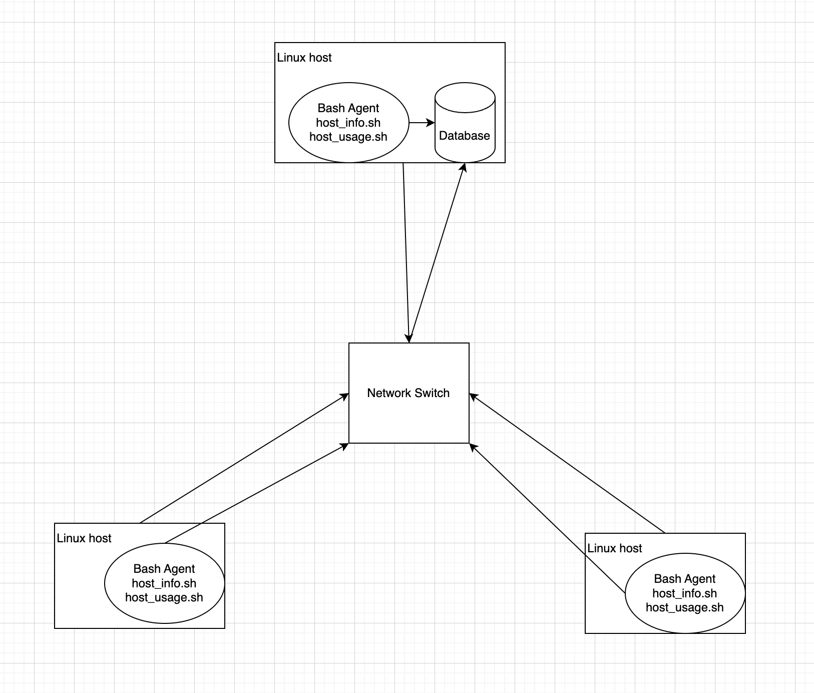

#Linux Cluster Monitoring Agent
## Introduction
#### What does this project do?
In this project, we are writing several shell script files that record the 
server's hardware information and monitor the server's resource usage in real-time(once a minute).
After that, the data will be stored in an RDBMS(PpstgreSQL in this project) for future planning purpose.

#### Who are the users?
Originally,the project is designed for the *Jarvis Linux Cluster Administration(LCA)* team which
manages a Linux cluster of 10 servers. The LCA team would like to collect the hardware specification
of each server and monitor the real-time states of the server's resource usage. The LCA team will
use the data to generate reports for future resource planning purposes.

#### Technologies used?
In this project, we use *git* to manage the code and use *git repository* to store the code.
The project was built and tested on *JRV(Jarvis Remote Desktop)*. We create *PSQL* Instance using
*docker* and connect the PSQL instance using *PSQL CLI tools*. We also write *bash script* and *ddl sql
script* to make the program automatically create docker instance, create table and insert date into
 the database.
- **Git&Git Repository:** manage and store the code.
- **Docker:** provision the PSQL instance.
- **JRV:** a remote desktop running centos 7.
- **Bash script&Linux Command:** implement the project.
- **PostgreSQL:** store the server's hardware and real-time usage data.

## Quick Start
Use markdown code block for your quick-start commands.
Using the psql_docker.sh file to create the PSQL instance(make sure docker installed).
```
#script usage
./scripts/psql_docker.sh start|stop|create [db_username][db_password]

#if first time, use create to create a psql docker container
./scripts/psql_docker.sh create db_username db_password

#to start the psql docker container
./scripts/psql_docker start

#to stop the psql docker container
./scripts/psql_docker stop

```
Create a database using psql CLI
```
#make sure the docker container is running
docker ps -f name=jrvs-psql

#install psql CLI client
sudo yum install -y postgresql

#set password for default user `postgres`
export PGPASSWORD='yourpassword'

#connect to the psql instance without password
psql -h localhost -U postgres -w

#create database
postgres=# CREATE DATABASE host_agent;

#exit database
postgres=# \q;

```
Create tables to store hardware specification and resource usage data
```

#create 'host_info' table and 'host_usage' table if not exist
#execute ddl.sql script on the host_agent database to create the table
psal -h localhost -U postgres -d host_agent -f sql/ddl.sql

```

Execute  host_info.sh to collect hardware specification data and then inserts the data into the psql
instance.
```
#script usage
./scripts/host_info.sh [psql_host] [psql_port] [db_name] [psql_user] [psql_password]

#script example
./scripts/host_info.sh localhost 5432 host_agent postgres password

```

Execute  host_usage.sh to collect server usage data and then inserts the data into the psql
instance.
```
#script usage
./scripts/host_usage.sh [psql_host] [psql_port] [db_name] [psql_user] [psql_password]

#script example
./scripts/host_usage.sh localhost 5432 host_agent postgres password

```

Execute host_usage.sh every minute to generate real-time server source usage data and insert 
data into the database.
```
#edit crontab jobs
bach > crontab -e

#execute host_usage.sh every minute(add this to crontab)
* * * * * [absolute path of host_usage.sh] [psql_host] [psql_port] [db_name] [psql_user] [psql_password]

#example
* * * * * /home/centos/dev/jarvis_data_eng_Enzuo/linux_sql/scripts/host_usage.sh localhost 5432 host_agent postgres password

```

## Implementation
1. Create a Linux server running with centos 7 and install the docker.
2. Create a psql instance using docker.
3. Install psql CLI client and Setup RDBMS psql database.
4. Create 'host_info' table to store the hardware information and  'host_usage' table to store the real-time server usage data.
5. Create agent for collecting hardware specification data and insert the data into database.
6. Create agent for collecting server usage data and then inserts the data into database.
7. Using crontab to automate 'host_usage' agent to generate real-time server usage data.

### Architecture
#### This is the architecture of the entire project.

### Scripts
This section will describe each shell script.
- *psql_docker.sh:*
  - The usage of psql_docker.sh is to create instance of psql database within docker container.\
    The script contains three variables, input command, username and password.\
    The script first check the status of docker container, after that the shell script will\
    switch case base to create, start or stop the container base on the input command.
- *host_info.sh:*
- *host_usage.sh:*
- *crontab:*
- *queries.sql:* (describe what business problem you are trying to resolve)

### Database Modeling

## Test

## Deployment

## Improvements